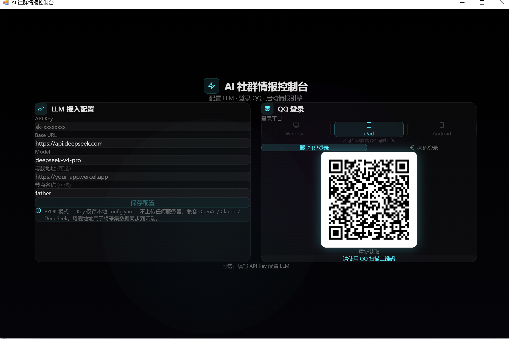
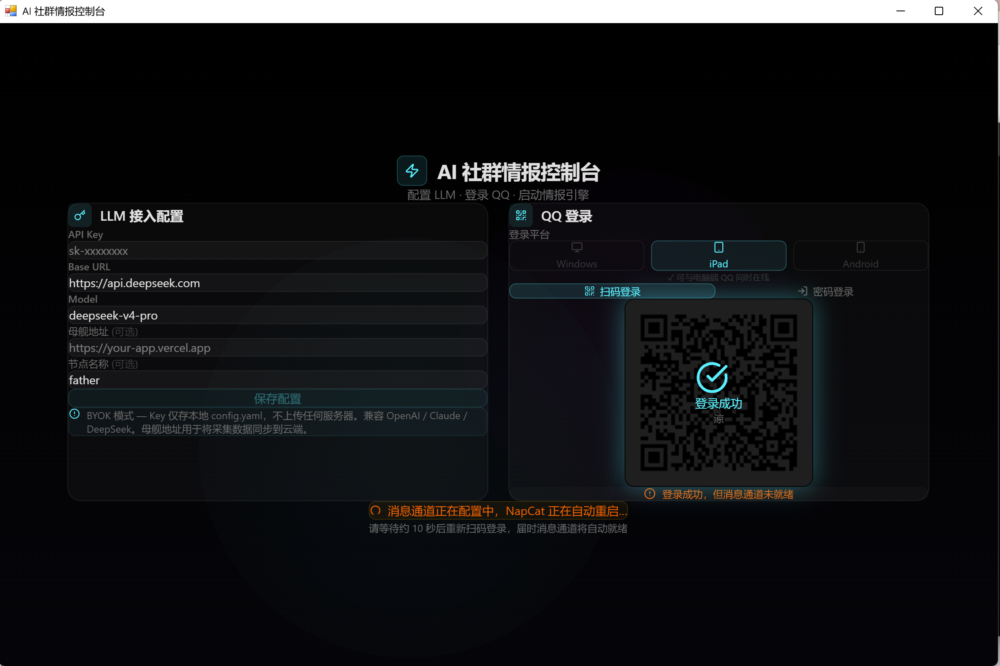
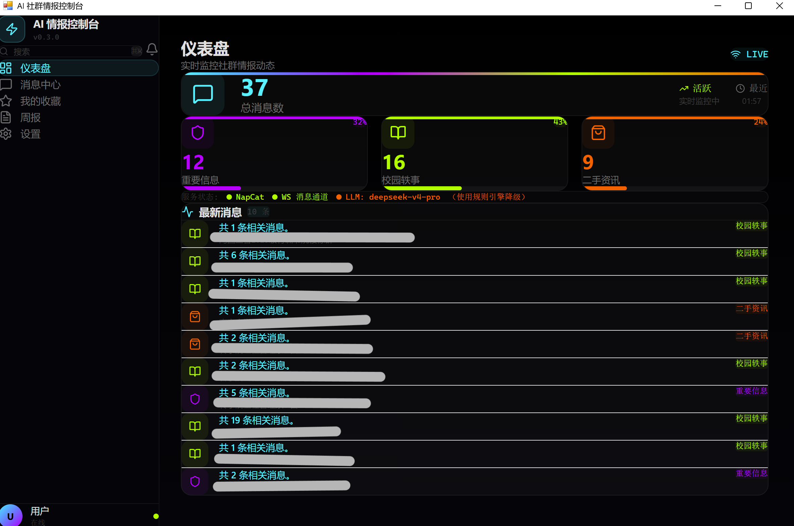

# AI 社群情报控制台 (nan-sentinel)

> 基于 LLM 的 QQ 消息实时分类与情报采集系统 — 桌面客户端

你是否曾在 QQ 群里被 99+ 的消息淹没，翻了半天才找到一条重要通知？你是否因为错过群里的一条二手交易信息而懊恼？**AI 社群情报控制台**就是为了解决这个问题而生的——它自动监听你的 QQ 消息，用大语言模型把每条消息智能分类，让你一目了然地看到什么是重要的、什么是有趣的、什么是值得交易的。





---

## 🚀 最新一次更新（2026-07-01）

这次更新主要解决两个很实际的问题：**AI 判断错了以后怎么办？母舰到底会看到多少东西？**

以前你点一下“判断正确”或“纠正分类”，系统只是把结果记下来；现在这次纠正真的会参与下一次判断。母舰也不再是一个含糊的“全量后台”，而是变成了需要学生主动加入、自己选择共享范围的协作空间。

### 🧠 AI 会记住你的纠正，但不需要在电脑上训练大模型

- 每次人工确认或纠正，都会保存消息特征、来源、原判断、纠正结果、置信度、模型和提示词版本
- 新消息到来时，系统会从本机找出 **3—5 条最相似的历史纠错案例**，一起交给 AI 参考
- 不同群可以设置不同的置信度门槛。低于门槛的消息进入“待确认”，不会硬着头皮瞎分，也不会直接同步给母舰
- 可以挑出一批“金标准”消息反复回放，直接看到 **校准前准确率 / 校准后准确率**，不是只靠一句“AI 已学习”糊弄人
- 提示词采用版本记录，更新后发现效果变差可以一键退回上一版
- 所有纠错案例默认只留在学生电脑上，不上传原始聊天记录

说白了，它不是偷偷训练一个新模型，而是像一个会翻错题本的助手：遇到相似题目时，先看看你上次是怎么改的。

### 🛰️ 母舰重新做了一遍授权逻辑

- 班委、社团负责人或老师先创建“协作空间”，再生成邀请密钥、链接或二维码
- 学生主动加入，并自己选择共享哪些群、A/B/C 哪些分类、是否允许脱敏证据以及授权多久
- 真正开启前会先展示“母舰将看到什么”，不满意可以不授权
- 学生可以随时暂停、修改范围、删除已经共享的数据或彻底退出
- 母舰想看某条完整原文时，只能先写明理由再申请；学生需要针对这一条再次批准
- 校准统计默认不共享。即使学生主动开启，也只上传复核数量、准确率、混淆矩阵和提示词版本，不包含正文、群名和发送者
- 纠错样本必须一条一条批准，上传前会脱敏，而且可以随时撤回

所以现在的母舰更像“多人协作处理重要事项的工作台”，不是老师远程查看学生聊天记录的监控后台。

### ✨ 其他改动

- 首页标题改成了“今日「情报」”——加引号是因为我们自己也知道，这不是什么谍战片里的真情报
- 保留原来的霓虹科技风格，重新整理了仪表盘、消息中心、设置和母舰页面布局
- 增加手机窄屏和小窗口适配，窗口缩小时不再只剩一条侧边栏
- 新增 CSV 历史导入和统一导入接口，可继续接飞书、钉钉、邮件、RSS 等来源
- 增加 19 项后端回归测试，覆盖分类校准、提示词回退、授权、脱敏、撤回和母舰数据删除

---

## 它能解决什么问题？

| 痛点 | 解决方案 |
|------|----------|
| QQ 群消息太多，重要通知被淹没 | 自动识别 **A 类重要信息**（考试安排、DDL、放假通知），置顶显示 |
| 想知道群里最近在聊什么八卦 | **B 类校园轶事**自动归类，随时浏览 |
| 错过群里的二手交易/代课/跑腿信息 | **C 类二手资讯**自动抓取，含虚拟服务（代课、拼车、合租等） |
| 想回顾本周群里发生了什么 | **LLM 周报生成**，一键总结本周 ABC 三类情报 |
| AI 偶尔分错，反复纠正还是会犯 | **本地校准学习**，自动参考过去 3—5 条相似纠错案例 |
| 飞书、钉钉或历史消息也想一起整理 | **统一导入接口**，不同来源先转换成同一种消息格式 |
| 多人协作采集，数据需要汇总 | **授权式情报母舰**，只汇总学生主动允许的结构化情报 |
| 不想安装 Python/Node.js 等开发环境 | **一键安装包**（EXE），双击即用，零配置 |

---

## 核心功能详解

### 🔍 LLM 智能三分类

消息进入后，系统会调用大语言模型（DeepSeek / OpenAI / Claude）进行语义理解，分为四类：

| 分类 | 含义 | 示例 |
|------|------|------|
| **A — 重要信息** | 学校官方正式通知 | "期末考试安排已出，请查看教务系统" |
| **B — 校园轶事** | 日常讨论、吐槽、学术交流 | "今天食堂的红烧肉绝了"、"高数挂科率多少啊" |
| **C — 二手资讯** | 真实交易意图（含虚拟服务） | "出一个二手显示器，200块"、"代课周三上午，50元" |
| **None — 垃圾信息** | 灌水、纯表情、无意义回复 | "哈哈哈哈哈"、"6"、"👍" |

**智能识别中文修辞**：不会把"卖萌"误判为二手交易，不会把"砸锅卖铁"当成卖废铁——LLM 理解语境，不做字面关键词匹配。

**LLM 不可用时自动降级**到规则引擎（基于关键词匹配），保证系统持续运行。

如果 AI 分错了，可以直接在消息卡片上确认或纠正。纠正结果会进入本机“错题本”，下次遇到相似内容时自动作为参考；置信度太低的消息则会进入待确认区，不会强行给出一个看似确定的答案。

### ⚡ 实时流模式 vs 📦 积攒模式

系统提供两种工作模式，适应不同场景：

#### 实时流模式（默认）

```
消息到达 → 立即调用 LLM 分类 → 写入数据库 → 仪表盘实时更新
```

**适合场景**：
- 你正在开会/上课，需要实时看到重要通知
- 你想第一时间捕捉二手交易信息（拼手速抢便宜货）
- 你不想在 99+ 消息里反复翻找刚才那条通知

**优点**：延迟最低，消息到达后几秒内即可看到分类结果。

#### 积攒模式（Batch）

```
消息到达 → 先存入缓冲池（不调 LLM） → 你手动点击"批量处理" → LLM 一次性分析所有消息
```

**适合场景**：
- 你不想每条消息都调 LLM（省钱！DeepSeek 按 token 计费）
- 你想攒一天的消息，晚上统一查看
- 你想让 LLM 看到完整对话上下文后再分类（多人讨论同一话题时，上下文很重要）

**优点**：
1. **省钱**：批量处理时 LLM 按话题聚类，而非逐条调用，API 调用次数大幅减少
2. **更准确**：LLM 能看到完整对话上下文。比如 A 问"有没有人出显示器"，B 回复"我有一个"，C 说"多少钱"——逐条分类可能漏掉，但批量处理时 LLM 能识别这是一个完整的交易讨论
3. **按话题聚类**：批量模式不只是分类，还会把相关消息聚合为一个"话题卡片"，每个话题包含完整的原始对话记录

### 📊 仪表盘

- **实时统计**：总消息数、ABC 各类数量、占比百分比
- **服务状态监控**：NapCat 引擎、WS 消息通道、LLM 配置状态，一目了然
- **最新消息流**：通过 SSE（Server-Sent Events）实时推送，新消息到达时自动刷新，无需手动刷新页面
- **LIVE 指示灯**：绿色 = 实时连接中，橙色 = 离线

### 📬 消息中心

- **分类浏览**：按 A/B/C 分类查看，或查看全部
- **待确认区**：低置信度消息先交给人判断，不直接进入母舰
- **人工纠错**：确认准确、修改分类或标记误报，结果会加入本地校准案例
- **持久状态**：消息会明确显示“已加入本地校准样本”，不是点完按钮就没下文
- **全文搜索**：搜索消息内容、摘要、发送人、群名
- **收藏管理**：一键收藏重要消息，支持自定义收藏夹（如"重要通知"、"好价二手"）
- **时间筛选**：查看最近 1 天 / 7 天 / 30 天的消息

### 📝 周报生成

基于 LLM 自动生成每周情报摘要：
- A 类：本周有哪些重要事项？
- B 类：本周有哪些有趣的校园故事？
- C 类：本周有哪些二手交易信息？

支持按分类单独生成，历史周报自动缓存。

### 🔗 多源导入

除了 QQ，系统现在还提供 CSV 历史导入和统一导入接口。飞书、钉钉、邮件、RSS 等平台只要通过转换器整理成统一格式，就可以走同一套分类、校准和消息管理流程。

目前完成的是统一接入口，不是已经替你绕过各个平台的授权。飞书、钉钉等来源仍然需要按照官方开放平台的规则创建应用、配置权限和事件回调。

### ☁️ 情报母舰

母舰用于班委、社团负责人、老师或学生团队共同处理重要通知和误报，不负责偷偷保存所有人的聊天记录。

管理员创建协作空间后，可以生成邀请密钥、链接或二维码。学生加入前要自己选择群、分类、证据范围和有效期，并先查看共享预览。母舰默认只收到分类、摘要、标签、置信度、来源类型等结构化信息；完整原文需要针对单条消息再次申请和批准。

学生可以随时暂停、撤回或删除共享数据。即使开启校准统计，上传的也只是匿名汇总；纠错样本必须逐条授权。

### 🖥️ 桌面客户端

- **pywebview 原生窗口**：不依赖浏览器，独立窗口运行
- **一键启动**：自动拉起 NapCat（QQ 协议引擎）+ API 服务器 + Scraper（消息采集器）
- **进程管理**：窗口关闭时自动清理所有子进程

---

## 快速开始

### 方式一：安装程序（推荐）

1. 从 [Releases](../../releases) 下载 `AIConsole_Setup_x.x.x.exe`
2. 双击安装程序 → Next → 选择目录 → Install
3. 桌面出现「AI 社群情报控制台」图标，双击启动
4. 首次启动会弹出配置窗口：
   - 填写 LLM API Key（推荐，用于获得更好的消息分类效果）
   - 选择 Base URL 和 Model（默认 OpenAI，可改为 DeepSeek / Claude）
5. 点击「保存配置」
6. 右侧会出现 QQ 登录界面，选择登录平台后扫码登录

如果需要加入母舰，不用自己复制技术令牌。让管理员发邀请密钥、链接或二维码，在“设置 → 情报母舰”里选择共享范围并确认即可。

### 方式二：便携版

1. 从 [Releases](../../releases) 下载 ZIP 包
2. 解压到任意目录
3. 双击 `AI_Console_Launcher.exe`

**系统要求**：Windows 10/11 x64，无需安装 Python 或 Node.js

---

## QQ 登录指南

### 登录平台选择

登录前需要选择登录平台，这决定了你的 QQ 是否会挤掉其他设备：

| 平台 | 说明 | 推荐 |
|------|------|------|
| **iPad** | 不会挤掉电脑端 QQ，可同时在线 | ✅ 推荐 |
| **Android** | 不会挤掉电脑端 QQ，可同时在线 | ✅ 推荐 |
| **Windows** | 会挤掉电脑端 QQ | ❌ 不推荐 |

### 扫码登录

1. 选择登录平台（推荐 iPad 或 Android）
2. 切换到「扫码登录」标签
3. 用手机 QQ 扫描二维码
4. 在手机上确认登录

> ⚠️ **二维码每 10 秒自动刷新**，这是正常行为。如果二维码过期，请等待自动刷新后重新扫描。
>
> ⚠️ 如果提示「二维码过期」，系统会自动获取新码，稍等几秒即可。

### 密码登录

1. 选择登录平台
2. 切换到「密码登录」标签
3. 输入 QQ 号和密码
4. 点击「登录」

> ⚠️ 密码登录可能会触发人机验证，遇到时请改用扫码登录。

### 首次登录的等待时间

首次登录时，系统需要配置 NapCat 的消息通道（WebSocket 服务器）。如果提示「消息通道正在配置中，NapCat 正在自动重启…」，请：

1. **等待约 10 秒**让 NapCat 完成重启
2. 重新扫码登录
3. 登录成功后会自动进入控制台

这是因为 NapCat 需要在登录后才能生成账号专属的配置文件，系统会自动写入 WebSocket 服务器配置并重启 NapCat，整个过程约 10 秒。

### 如果遇到问题

- **二维码不显示**：检查 NapCat 是否启动（查看服务状态中 NapCat 是否为绿色）
- **登录后没有消息**：检查 WS 消息通道状态，如果显示橙色，点击「重新获取」或重启程序
- **已登录但提示未登录**：点击「重新获取」清除登录缓存，重新扫码

---

## 截图说明

| 截图 | 说明 |
|------|------|
| 图 1、图 2 | 登录界面 — 左侧配置 LLM，右侧扫码/密码登录 QQ |
| 图 3 | 主界面 — 仪表盘实时监控，ABC 三类消息统计，最新消息流 |

---

## 架构

```
┌─────────────────────────────────────────────────┐
│                 用户本地 (一键启动)                │
│                                                  │
│  ┌──────────────┐    ┌────────────────────────┐  │
│  │  pywebview   │    │    FastAPI Server      │  │
│  │  原生窗口     │◄──►│    (localhost:8000)    │  │
│  │  React SPA   │    │  静态文件 + REST API    │  │
│  └──────────────┘    └────────────────────────┘  │
│                                                  │
│  ┌──────────────┐    ┌────────────────────────┐  │
│  │    NapCat     │    │     Scraper Agent      │  │
│  │  QQ 协议引擎  │◄──►│  WS 监听 → LLM 分类   │  │
│  │  (port 6099)  │    │  → SQLite / 校准 / 母舰 │  │
│  └──────────────┘    └────────────────────────┘  │
│                                                  │
│  用户数据: %APPDATA%/AIConsole/                   │
│  ├── market.db        (消息数据库)                │
│  └── config.yaml      (用户配置)                  │
└─────────────────────────────────────────────────┘
```

## 项目结构

```
nan-sentinel/
├── backend/                    # 后端服务
│   ├── api.py                 # FastAPI 服务器（REST API + SSE + 静态文件托管）
│   ├── calibration.py         # 本地校准、相似案例检索、金标准回放
│   ├── scraper.py             # WebSocket 消息监听 + LLM 分类引擎
│   ├── config.yaml.example    # 配置模板
│   └── requirements.txt
├── frontend/                   # React 前端
│   ├── src/
│   │   ├── pages/
│   │   │   └── LoginPage.tsx       # LLM 配置 + QQ 登录
│   │   └── components/
│   │       ├── DashboardPage.tsx   # 仪表盘（统计 + 服务状态 + 最新消息）
│   │       ├── MessagesPage.tsx    # 消息中心（分类浏览 + 搜索 + 收藏）
│   │       ├── BookmarksPage.tsx   # 收藏夹管理
│   │       ├── ReportsPage.tsx     # 周报生成
│   │       ├── CalibrationCenter.tsx # 本地校准中心
│   │       ├── MothershipPage.tsx   # 组织母舰工作台
│   │       ├── SettingsPage.tsx    # 系统设置
│   │       ├── Layout.tsx          # 主布局（侧边栏 + 内容区）
│   │       └── ProtectedRoute.tsx  # 登录路由守卫
│   └── dist/                  # 构建输出（已包含在仓库中）
├── mothership/                 # 独立母舰服务（空间、授权、复核、审计）
│   ├── app.py
│   └── bootstrap.py
├── tests/                      # 后端与母舰回归测试
├── docs/                       # 复赛架构与母舰升级说明
├── launcher.py                 # 桌面客户端启动器（PyInstaller 入口）
├── build_exe.py                # EXE 打包脚本
├── installer.iss               # Inno Setup 安装程序脚本
├── fetch_napcat.py             # NapCat 下载脚本
├── PRODUCT.md                  # 产品定位、角色与隐私边界
└── .gitignore
```

## 技术栈

| 层级 | 技术 |
|------|------|
| 前端 | React 19 + TypeScript + Vite + Tailwind CSS |
| 桌面客户端 | pywebview（Edge Chromium 内核） |
| 后端 | Python FastAPI + SQLite + aiohttp |
| QQ 协议 | NapCat（OneBot11 WebSocket） |
| LLM | OpenAI API 兼容（DeepSeek / Claude / GPT） |
| 多源接入 | QQ/NapCat + CSV + 统一导入 API |
| 协作端 | 独立 FastAPI 母舰 + 邀请授权 + 审计 |
| 打包分发 | PyInstaller + Inno Setup |

## API 接口

| 方法 | 路径 | 说明 |
|------|------|------|
| GET | `/api/health` | 健康检查 |
| GET | `/api/services` | 各服务运行状态 |
| GET/POST | `/api/config` | 配置管理 |
| GET | `/api/qrcode` | 获取 QQ 登录二维码（PNG） |
| GET | `/api/login/status` | QQ 登录状态（轮询） |
| POST | `/api/login/password` | 密码登录 |
| POST | `/api/login/reset` | 重置登录缓存 |
| GET | `/api/stats` | 消息统计 |
| GET | `/api/messages` | 查询已分类消息（支持筛选/搜索/分页） |
| POST | `/api/messages/{msg_id}/feedback` | 确认或纠正分类，加入本地校准 |
| GET | `/api/calibration` | 本地校准策略、案例和评测结果 |
| POST | `/api/calibration/evaluate` | 回放金标准测试集 |
| POST | `/api/sources/import` | 导入 CSV 转换后的多源消息 |
| DELETE | `/api/messages/{id}` | 删除消息 |
| POST | `/api/bookmarks` | 添加收藏 |
| GET | `/api/bookmarks` | 查询收藏 |
| GET | `/api/weekly_summary` | 生成/获取周报 |
| GET | `/api/stream` | SSE 实时消息推送 |
| POST | `/api/batch_process` | 批量处理缓冲池 |
| POST | `/api/restart-napcat` | 重启 NapCat |
| POST | `/api/mothership/membership/join` | 学生接受邀请并保存授权 |

## 开发

```bash
# 后端
cd backend
pip install -r requirements.txt
python api.py                # 启动 API 服务器 (localhost:8000)
python scraper.py            # 启动消息采集器

# 前端
cd frontend
npm install
npm run dev                  # 开发模式 (localhost:5173)
npm run build                # 构建生产版本

# 运行母舰（首次启动会生成管理员密钥）
cd ..
.\backend\venv\Scripts\python.exe -m mothership.bootstrap

# 运行回归测试
.\backend\venv\Scripts\python.exe -m unittest discover -s tests -v

# 打包 EXE
python build_exe.py          # 生成 dist_output_exe/

# 打包安装程序
# 用 Inno Setup 打开 installer.iss → Build → Compile
```

## 数据持久化

用户数据存储在 `%APPDATA%/AIConsole/`：

| 文件 | 说明 |
|------|------|
| `market.db` | 消息数据库（SQLite） |
| `config.yaml` | 用户配置（API Key、NapCat 设置等） |

- 更新安装时**不会覆盖**已有数据
- 卸载时会提示是否保留数据
- 开发模式下数据存储在项目根目录
- 每个用户通过昵称隔离数据，只能看到自己的消息

## 飞书、钉钉等来源怎么接？

当前版本先把“入口”修好了：无论消息来自 CSV、飞书、钉钉、邮件还是 RSS，只要转换成统一格式，就可以交给南哨继续分类、校准和整理。

统一接口是：

```text
POST http://127.0.0.1:8000/api/sources/import
```

最少只需要提供一条消息正文：

```json
{
  "source_type": "feishu",
  "source_name": "课程通知",
  "messages": [
    {
      "id": "message-001",
      "channel_name": "计科二班",
      "sender_name": "班委",
      "content": "数据结构考试地点调整到教学楼 201"
    }
  ]
}
```

不过这里要说清楚：**有统一入口，不等于已经原生接好了所有平台。** 飞书、钉钉仍然要按照各自开放平台的规则创建应用、申请权限、验证签名，再用一个小转换器把事件送进这个接口。这样写虽然没那么唬人，但比赛答辩时不会被老师一句“你真的接通了吗”问住。

## 常见问题

### Q: 为什么二维码一直刷新？
二维码每 10 秒自动刷新一次，这是为了防止过期。如果扫码时提示过期，等几秒让新码出来即可。

### Q: 登录后提示「消息通道正在配置中」怎么办？
首次登录需要配置 WebSocket 通道。请等待约 10 秒让 NapCat 自动重启，然后重新扫码登录。

### Q: 选择哪个登录平台？
推荐选择 **iPad** 或 **Android**，这样不会挤掉你电脑上正在使用的 QQ。选择 Windows 会挤掉电脑端。

### Q: LLM API Key 怎么获取？
- **DeepSeek**：访问 [platform.deepseek.com](https://platform.deepseek.com) 注册，创建 API Key
- **OpenAI**：访问 [platform.openai.com](https://platform.openai.com) 注册
- **Claude**：访问 [console.anthropic.com](https://console.anthropic.com) 注册

系统兼容所有 OpenAI 格式的 API，只需修改 Base URL 即可切换服务商。

### Q: 没有配置 API Key 能用吗？
可以。系统会自动降级到规则引擎（基于关键词匹配），但分类准确率会降低。建议配置 LLM 以获得最佳体验。

### Q: 数据存在哪里？
用户数据存储在 `%APPDATA%/AIConsole/`（Windows），包括数据库 `market.db` 和配置文件 `config.yaml`。更新安装不会覆盖已有数据。

### Q: 点“判断正确”或“纠正分类”以后，AI 真的会变准吗？
会，但不是在你电脑上重新训练一次大模型。系统会把这条纠正存进本地案例库，下次遇到相似消息时挑出 3—5 条给 AI 参考。你还可以用金标准回放查看校准前后的准确率，效果不好也能停用案例或回退提示词版本。

### Q: 母舰是不是能看到我的所有群聊？
不能。你需要主动接受邀请，并选择允许共享的群、分类、证据范围和期限。默认上传的是结构化摘要，不包含发送者身份和完整原文。管理员需要原文时必须单独申请，你也可以拒绝。

### Q: 为什么有些消息会显示“待确认”？
因为系统对这条判断没那么有把握。与其硬塞进某一类，不如先让人看一眼；确认以后它还会变成新的本地校准案例。

## 合规声明

- 本项目使用的 NapCat 是基于 QQNT 协议的开源实现，仅供学习和研究用途
- 请遵守 QQ 的服务条款和相关法律法规
- 不得将本项目用于任何商业用途或侵犯他人隐私的行为
- 使用者需自行承担因使用本项目而产生的一切风险和责任

## License

[MIT](LICENSE)

## 致谢

- [NapCat](https://github.com/NapNeko/NapCatQQ) — QQ 协议框架
- [FastAPI](https://fastapi.tiangolo.com/) — Python Web 框架
- [React](https://react.dev/) — 前端框架
- [pywebview](https://pywebview.flowrl.com/) — 桌面窗口框架
- [Inno Setup](https://jrsoftware.org/isinfo.php) — Windows 安装程序
