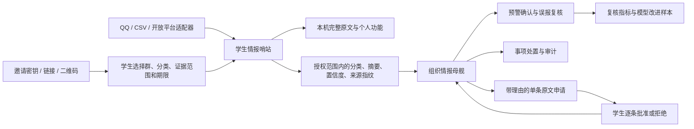

# 情报母舰升级说明（复赛版）

## 一句话定位

Nan Sentinel 是“学生情报哨站 + 组织情报母舰”：学生把自己有权访问的群消息变成可检索、可核验的个人情报；授权组织只接收必要的结构化情报，用于跨来源预警、人工复核和处置闭环。

这里的“情报”不是秘密监控，而是把高噪声社群信息加工成可验证、可处理、可追责的事项。

## 两类用户与价值

| 使用者 | 核心问题 | 产品价值 |
| --- | --- | --- |
| 学生 | 群太多、通知易漏、搜索困难 | 本机聚合、分类、收藏、周报、回到原文核验 |
| 班委/辅导员/社团负责人 | 多来源事项无法统一研判，误报无人处理 | 跨哨站预警、复核、纠正、状态流转、节点健康和审计 |

个人版不是组织版的缩水版：个人版保存完整上下文并服务个人效率；组织版不默认获得完整原文，重点是汇总和管理闭环。

## 架构与数据边界

默认上传字段：情报 ID、A/B/C 分类、摘要、标签、置信度、来源类型/名称、哈希化来源指纹和发生时间。

默认不上传：发送者身份、完整聊天原文、私聊内容、本机昵称和收藏。学生可主动允许“脱敏证据片段”，但也只上传最多 300 字且已过滤常见手机号、邮箱、QQ/微信联系方式的片段。完整原文只能由管理员说明理由后申请，学生在本机看到原文并逐条二次批准，批准内容 7 天后清除。

## 已形成的管理闭环

1. 管理员创建协作空间，系统生成仅显示一次的邀请密钥、邀请链接和二维码。
2. 学生主动接受邀请，选择允许共享的群、A/B/C 分类、是否附带脱敏证据和授权期限。
3. 授权前展示真实共享预览；未选择的群、以后新增的来源和完整原文均不自动上传。
4. 学生确认后，本机获得独立成员密钥；哨站将授权范围内的结构化情报写入待发队列，断网时保留重试。
5. 母舰按节点去重，展示成员授权状态、来源覆盖和待确认 A 类预警。
6. 管理员可确认准确、标记误报、纠正分类，并把事项从待处理推进到已完成。
7. 如摘要不足，管理员必须填写理由申请单条原文；学生看到本机原文后逐次批准或拒绝。
8. 学生可暂停、修改范围、删除母舰数据或撤销；邀请生成、成员加入、复核、原文申请和处置均进入审计。

这回答了评委意见中的两个重点：多源数据通过统一导入契约进入同一处理链，误报通过人工复核、分类纠正、准确率统计和审计形成闭环。

## 复赛演示脚本（3 分钟）

1. 管理员创建“计科二班通知协作”，展示邀请密钥、链接和二维码。
2. 学生打开邀请，只勾选“课程通知群 + A 类重要预警”，关闭证据片段，并查看母舰将看到的真实预览。
3. 学生确认加入并同步；母舰只出现这一个来源的一条 A 类情报，其他群消息没有进入。
4. 管理员填写核验理由申请原文；切回学生端，展示原文仍在本机以及“只发送这一条”的二次确认。
5. 学生批准后切回母舰查看原文及自动清除时间，再演示误报复核和处置流转。
6. 学生暂停共享或管理员停用哨站，说明成员密钥立即停止上传且不影响其他成员。

演示时不要把“总消息数”作为核心成绩。更有说服力的指标是漏看率下降、平均发现时间、A 类预警人工确认率、误报率和平均处置时长。

## 评委可能追问

### 这是不是监控学生？

不是。学生通过邀请主动加入，并逐项选择群、分类、证据和期限；加入前可以看到真实共享预览。组织端默认只接收结构化情报，不接收发送者身份和完整原文。学生可暂停、删除已共享数据或撤销，新增来源不会自动继承权限。

### AI 误报怎么办？

重要预警不是自动成为结论。母舰把 A 类信息放入待确认队列，管理员可确认、标记误报或纠正分类；指标只统计人工复核样本，所有动作都有审计记录。

### 为什么需要母舰，个人端不够吗？

个人端解决“我不要漏消息”，母舰解决“组织如何在多个授权来源之间统一确认、分派和跟进事项”。两者保存的数据和权限不同，价值也不同。

### 老师能直接看到学生群聊吗？

不能。老师、班委或社团负责人都只可能是协作空间管理员，身份本身不产生读取权限。管理员看到的是学生明确授权的结构化情报；需要原文时必须说明理由，学生逐条批准，不能批量开启长期原文访问。

### 为什么目前 QQ 用 NapCat？

NapCat 能在用户本机把已有 QQ 群消息接入哨站，但属于非官方方案。产品层已经把采集与分析解耦，CSV、Webhook 和开放平台适配器都可进入统一导入契约；后续按平台权限补齐官方适配，而不是把系统绑定在 NapCat 上。

### 多个组织如何隔离？

当前复赛版按独立母舰部署隔离组织，并通过管理员密钥、邀请密钥和每哨站独立成员密钥分权。邀请密钥可轮换，成员密钥可单独停用。正式运营版仍需要增加账号登录、组织租户和更细的 RBAC。

## 下一阶段优先级

### P0：复赛稳定性

- 准备脱敏演示数据和断网重试演示。
- 固化 10—20 条金标准样本，展示误报纠正前后的指标。
- 给母舰部署 HTTPS，并准备数据库备份/恢复脚本。

### P1：试点能力

- 接入一个官方开放平台适配器（优先飞书或钉钉），形成真实的第二数据源。
- 增加管理员登录、组织租户和 RBAC。
- 增加处置负责人、截止时间和超时提醒。

### P2：规模化

- 复核结果回流分类提示词或训练集，做分来源阈值校准。
- 增加来源质量评分、预警趋势与平均处置时长。
- 完成数据授权、导出、删除、留存和合规审计流程。
